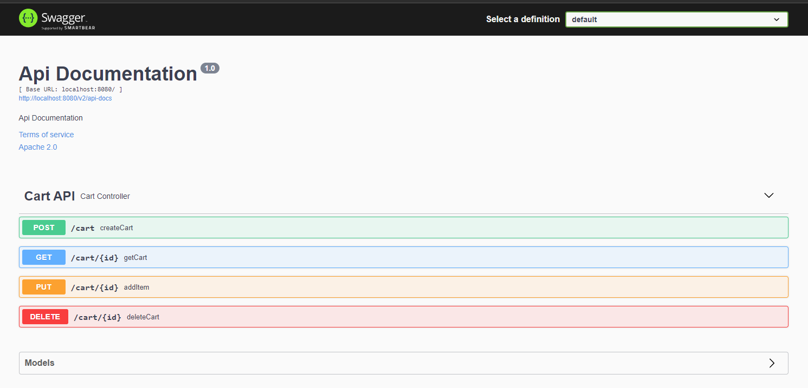
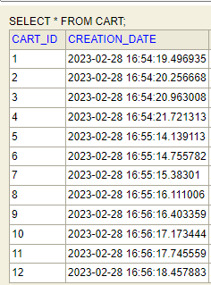
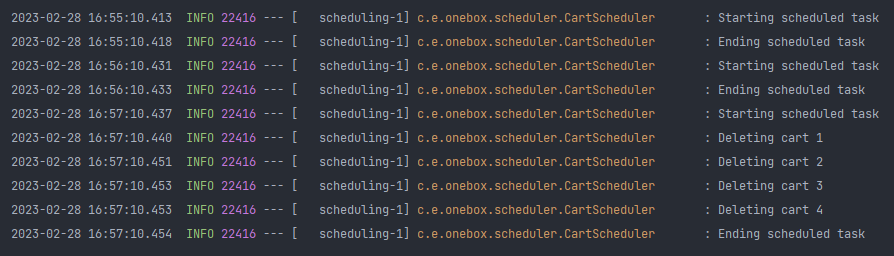
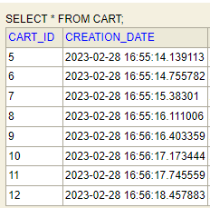
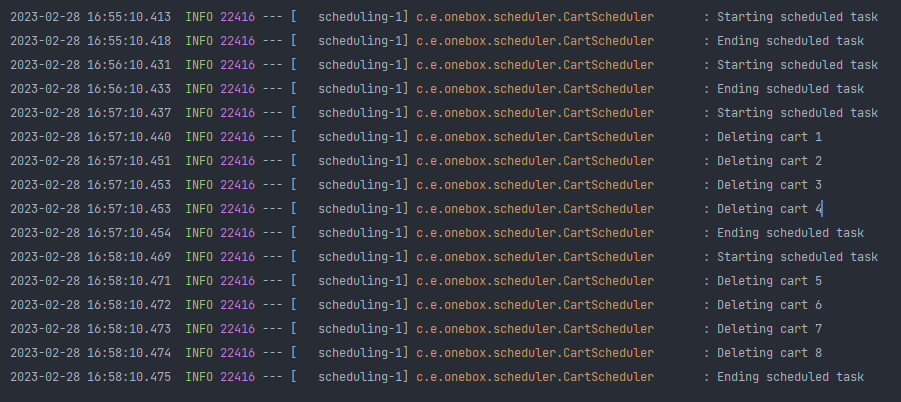
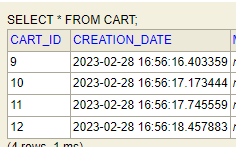

# OneBox

### Database

- For the database, an H2 In-Memory embedded was used. This can be consulted locally through the url `http://localhost:8080/h2-console/`.
- The credentials are:
```
user: onebox
passoword: onebox
```

### Documentation
- The API documentation was made with `Swagger UI - REST API Documentation Tool`, which can be accessed through the URL `http://localhost:8080/swagger-ui.html/` 
  - **important**: Add backslash "/" at the end of the URL
- Endpoints can be tested using the ¨swagger¨ tool
- The challenge was developed with java 11.

<details>
  <summary>SWAGGER-UI</summary>



</details>


### Testing

- The project has unit tests with `junit5` and `mockito`

### API
- The API has a handler for exceptions (controller advice) for when you want to throw by data validation.
- The Object-Relational Mapping (ORM) was developed with `hibernate`
- The `DTO` design pattern is used to handle requests and response from the controllers and a manual mapper for its conversion to entity and vice versa
- In this case, libraries such as `mapstruct` or `modelmapper` could have been used for its facilitation
- Spring boot 2.6.6 was used as global framework

### SERVICES

The services are responsible for the business logic of the application and are the following:
  - CartService
    - createCart
    - addProductToCart
    - getCart
    - deleteCart
  - CartScheduler
    - deleteExpiredCarts
        - This service is responsible for deleting the carts that have not been accessed for more than 10 minutes,
          so the cart ttl is refreshed when we add an item
        - The scheduler runs every 1 minute checking if there are carts to be deleted
        
    
<details>
  <summary>EVIDENCE</summary>

### Create cart

<details>
  <summary>POST localhost:8080/cart/</summary>

#### Request
  ```JSON
  {}
  ```
#### Response
  ```JSON
  {
    "cartId": 1,
    "items": []
  }
  ```
</details>

### Add one product to cart

<details>
  <summary>PUT localhost:8080/cart/1</summary>

#### Request
  ```JSON
{
    "description": "T Shirt",
    "amount": "250.23"
}
  ```
#### Response
  ```JSON
{
    "cartId": 1,
        "items": [
        {
          "cartItemId": 1,
          "cartId": 1,
          "description": "T Shirt",
          "amount": 250.23
        }
    ]
}
  ```
</details>

### Add second product to cart

<details>
  <summary>PUT localhost:8080/cart/1</summary>

#### Request
  ```JSON
{
    "description": "Pants",
    "amount": "124.5"
}
  ```
#### Response
  ```JSON
  {
    "cartId": 1,
    "items": [
     {
       "cartItemId": 1,
       "cartId": 1,
       "description": "T Shirt",
        "amount": 250.23
     },
     {
       "cartItemId": 2,
       "cartId": 1, 
       "description": "Pants", 
       "amount": 124.5
     }
    ]
  }
  ```
</details>

### Get cart

<details>
  <summary>GET localhost:8080/cart/1</summary>


#### Response
  ```JSON
  {
    "cartId": 1,
    "items": [
     {
       "cartItemId": 1,
       "cartId": 1,
       "description": "T Shirt",
        "amount": 250.23
     },
     {
       "cartItemId": 2,
       "cartId": 1, 
       "description": "Pants", 
       "amount": 124.5
     }
    ]
  }
  ```
</details>

### Delete cart

<details>
  <summary>DELETE localhost:8080/cart/1</summary>


#### Response
Http Status 200
</details>

### Get non existing cart

<details>
  <summary>GET localhost:8080/cart/1</summary>


#### Response
  ```text
  The shopping cart was not found.
  ```
</details>

### SCHEDULER

<details>
  <summary> Delete carts</summary>

For testing purposes, the cart ttl was set to 2 minute, so after 2 minutes the carts will be deleted.

1. We create four carts every 1 minute for 3 minutes 

    
2. So in the first 2 times the scheduler will not delete any cart because first two times it's at minute 0 and 1
3. The third time it will delete the first four carts. 
    

4. The fourth time it will delete the next four carts and so on.


</details>

</details>


